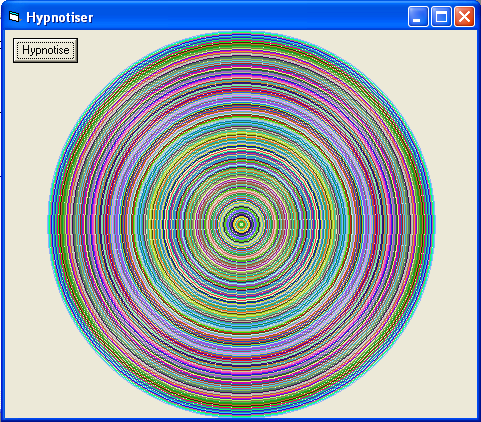

<div align="center">

## Hypnotiser


</div>

### Description

Looks pretty cool
 
### More Info
 
1 timer named "Timer1"


<span>             |<span>
---                |---
**Submitted On**   |
**By**             |[indolg](https://github.com/Planet-Source-Code/PSCIndex/blob/master/ByAuthor/indolg.md)
**Level**          |Beginner
**User Rating**    |4.3 (17 globes from 4 users)
**Compatibility**  |VB 3\.0, VB 4\.0 \(16\-bit\), VB 4\.0 \(32\-bit\), VB 5\.0, VB 6\.0
**Category**       |[Jokes/ Humor](https://github.com/Planet-Source-Code/PSCIndex/blob/master/ByCategory/jokes-humor__1-40.md)
**World**          |[Visual Basic](https://github.com/Planet-Source-Code/PSCIndex/blob/master/ByWorld/visual-basic.md)
**Archive File**   |[](https://github.com/Planet-Source-Code/indolg-hypnotiser__1-56174/archive/master.zip)


### Source Code

```
Private Sub Timer1_Timer()
ScaleMode = 3 ' set scale to pixils
X = ScaleWidth / 2 ' set x position
Y = ScaleHeight / 2 'set y position
If X > Y Then limit = Y Else limit = X
For radius = 0 To limit ' set radius
Circle (X, Y), radius, RGB(Rnd * 255, Rnd * 255, Rnd * 255)
Next radius
End Sub
```

